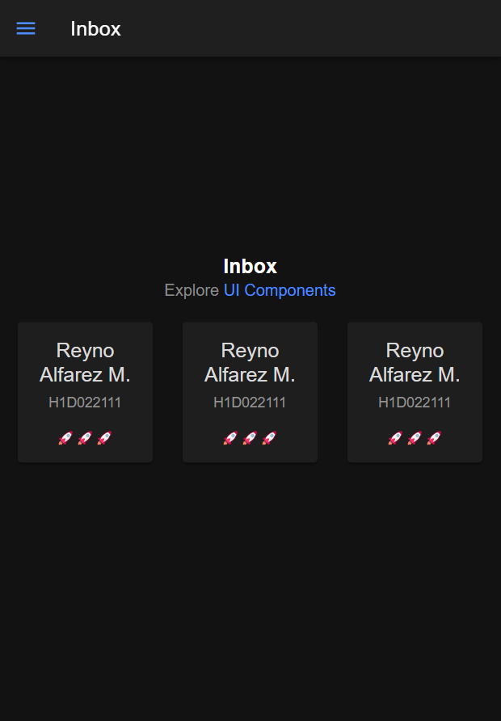

# Tugas 6 Praktikum Mobile
## Screenshot Aplikasi

## Cara Menambahkan Komponen Pada Ionic
1. Buka halaman https://ionicframework.com/docs/components untuk melihat daftar komponen yang disediakan Ionic
2. Pilih komponen yang ingin digunakan, dalam kasus ini grid dan card
3. Salin kode komponen dari dokumentasi dan tempelkan di file html halaman yang dipilih, pada kasus ini di halaman folder.page.html
4. Tambahkan styling di file folder.page.scss untuk menambahkan style komponen
5. Jalankan program dengan menggunakan command 'ionic s' pada terminal
